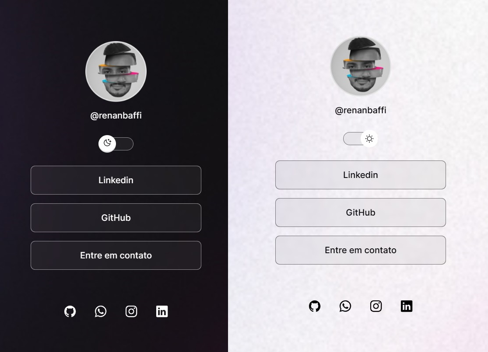

<h1 align="center"> DevLinks </h1>

Curso exclusivo da Rocketseat para ensino de tecnologia WEB.

  <a href="#-tecnologias">Tecnologias</a>&nbsp;&nbsp;&nbsp;|&nbsp;&nbsp;&nbsp;
  <a href="#-projeto">Projeto</a>&nbsp;&nbsp;&nbsp;|&nbsp;&nbsp;&nbsp;
  <a href="#memo-licença">Licença</a>

 

  
  

## 🚀 Tecnologias

Esse projeto foi desenvolvido com as seguintes tecnologias:

- HTML e CSS
- JavaScript
- Git e Github
- Figma

## 💻 Projeto

O DevLinks é um agregador de links para usar como cartão de visitas virtual.
Link do projeto: https://renanbaffi.github.io/Projeto-DevLinks
## :memo: Licença

Esse projeto está sob a licença MIT.

---

